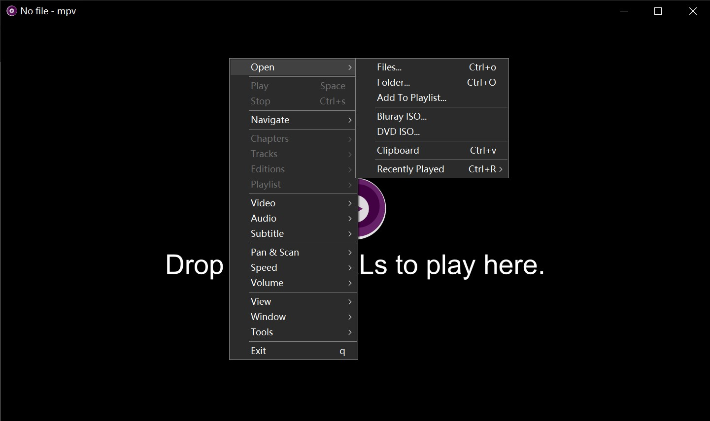

# mpv-menu-plugin

Customizable context menu for mpv on Windows, based on the [C PLUGINS](https://mpv.io/manual/master/#c-plugins) API.



See also [mpv-debug-plugin](https://github.com/tsl0922/mpv-debug-plugin).

## Installation

[mpv](https://mpv.io) >= `0.37.0` is required, and the `cplugins` feature should be enabled.

Download the plugin from Releases, place `menu.dll` and `dyn_menu.lua` in your mpv `scripts` folder.

## Configuration

### input.conf

> Want a usable full config example? Check [here](https://gist.github.com/tsl0922/8989aa32994b0448a2652ee260348a35).

The menu syntax is similar to [mpv.net](https://github.com/mpvnet-player/mpv.net), with some enhancements:

- define menu title after `#menu:`
  - define separator with `-`
  - split title with `>` to define submenus
  - use `#@keyword` to display selection menu for:
    - `#@tracks`: track list (video/audio/subtitle)
      - `#@tracks/video`: video track list
      - `#@tracks/audio`: audio track list
      - `#@tracks/sub`: subtitle list
      - `#@tracks/sub-secondary`: subtitle list (secondary)
    - `#@chapters`: chapter list
    - `#@editions`: edition list
    - `#@audio-devices`: audio device list
    - `#@playlist`: playlist
    - `#@profiles`: profile list
  - use `#@prop:check` to check menu item if property type and value is:
    - `boolean`: `true`
    - `string`: not empty
    - `number`: not zero
    - `table`: not empty
    - none of above: not `nil`
- use `_` if no keybinding
- use `ignore` if no command

```
Ctrl+a  show-text foobar    #menu: Foo > Bar
_       ignore              #menu: -
_       ignore              #menu: Tracks #@tracks
_       ignore              #menu: Chapters #@chapters
_       ignore              #menu: Editions #@editions
_       ignore              #menu: -
_       cycle mute          #menu: Audio > Mute #@mute:check
_       ignore              #menu: Audio > Devices #@audio-devices
```

Add a keybinding to trigger the menu (required):

```
MBTN_RIGHT script-message-to menu show
```

**NOTE:**

- If you changed the dll name, `script-message-to` target and conf file name should apply too.
- If the menu doesn't always show on mouse click, Rename other scripts that used the `menu` name.

If both `menu.dll` and `menu.lua` exists in scripts folder, one of it may be named with `menu2` by mpv,
`script-message-to menu show` will break when it happens on `menu.dll`.

### ~~/script-opts/menu.conf

- `load=no`: Disable menu load on startup.
- `uosc=yes`: Enable [uosc](https://github.com/tomasklaen/uosc#syntax) menu syntax support.

### ~~/script-opts/dyn_menu.conf

- `max_title_length=80`: Limits the title length in dynamic submenu, set to 0 to disable.

## Updating menu from script

The menu data is stored in `user-data/menu/items` property with the following structure:

```
MPV_FORMAT_NODE_ARRAY
  MPV_FORMAT_NODE_MAP (menu item)
     "type"           MPV_FORMAT_STRING     (supported type: separator, submenu)
     "title"          MPV_FORMAT_STRING     (required if type is not separator)
     "cmd"            MPV_FORMAT_STRING     (optional)
     "state"          MPV_FORMAT_NODE_ARRAY[MPV_FORMAT_STRING] (supported state: checked, disabled)
     "submenu"        MPV_FORMAT_NODE_ARRAY[menu item]         (required if type is submenu)
```

Updating this property will trigger an update of the menu UI.

To reduce update frequency, it's recommended to update this property in [mp.register_idle(fn)](https://mpv.io/manual/master/#lua-scripting-mp-register-idle(fn)).

## Credits

This project contains code copied from [mpv](https://github.com/mpv-player/mpv).

# License

[GPLv2](LICENSE.txt).
